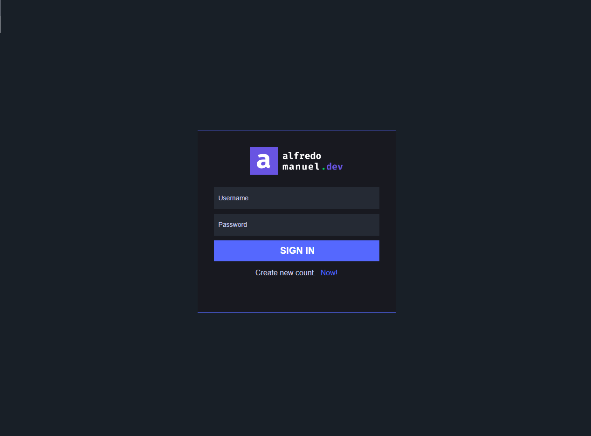

# Login Dark 
Dark Mode is a subject (and implementation) that, over time, has been gaining more and more attention, prominence and studies — not by chance, as this dark mode does have its importance in UX and UI.

I'm a back-end developer but I like and admire the front-end.

Develop this small login screen using some basic tools in the universe, such as HTML, CSS, JS.

The idea was to practically test my skills as a front-end.

